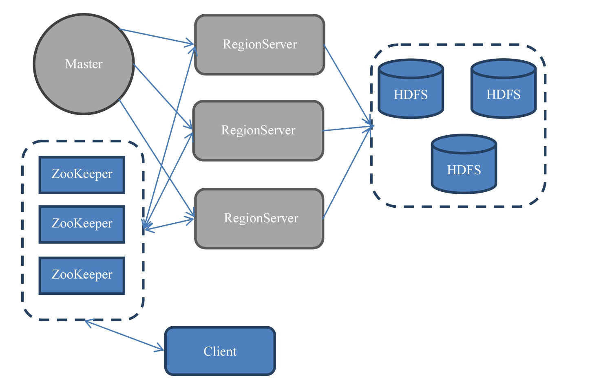
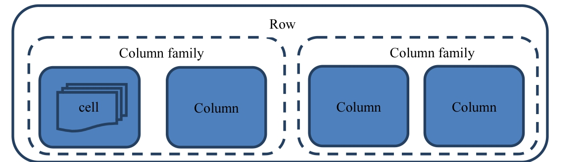

### HBase的来源 

#### 海量数据与NoSQL

1. 关系型数据库的极限

   - 并发的进行插入、编辑以及删除的操作，达到几十或者几百的并发时，单条数据的查询延时会达到分钟的级别
   - 深度优化后的性能依然是高并发系统的主要瓶颈

2. CAP理论

   1. 原子性
   2. 一致性
   3. 分区容错性

   CAP原理指出三者只能兼顾2点

1. NoSQL
   1. 放弃某些特性带来了非关系型数据库，对事务性的要求不严格
      - 有些只保证最终一致性
      - 有些数据库在部分宕机的情况下依然运行(同一份数据放到好几个地方)
      - Not Only SQL

#### HBase怎么来的

1. Google的BigTable项目，作为Hadoop的一部分；
2. 分布式的文件系统(HDFS)
3. HBase采用Key/Value的存储，数据量增大很多，不会影响查询的效率
4. 列式数据库，把不同的字段部分放到不同的机器上
5. 带来的问题是，只是存储少量的数据也不会很快
6. 当单表的数据量很大，并发很高，数据分析的需求很弱可以使用HBase

#### 基本概念

1. 部署架构

   

   1. 基本结构
      - MasterServer：负责维护表结构信息；
      - RegionServer：实际数据存储
      - 所以当MasterServer挂了之后依然可以查询数据，但是不能新增表了；
   2. 数据存储
      - 数据存储在HDFS上
      - ZooKeeper相当于管家的角色，管理所有的RegionServer的信息，包括具体的数据段存放在哪个RegionServer上
   3. 微观上的细节
      - Region是什么？
        1. 是一段数据的集合
        2. 不能跨服务器，一个RegionServer上有一个或者多个Region
        3. 数据量小的时候一个Region可以包含所有的数据，数据量大的时候会分Region
        4. Region是基于HDFS的，所有的数据的存取操作都调用了HDFS的客户端接口
      - RegionServer是什么？
        1. 是存放Region的容器，直观上是服务器上的一个服务
        2. ZooKeeper获取了RegionServer的地址后，会直接从这里获取数据
      - Master是什么？
        1. Master只负责各种打杂的工作，建表和删表、移动Region，合并等操作。共同特性是需要跨RegionServer。

2. 存储架构

   

   1. 最基本的存储单位是列，一个列或者多个列形成一行。HBase的列数据可以不完全的对齐，不同的列也可以存储在不同的机器上。
   2. 每行拥有唯一的Row key来标定这个行的唯一性，每个列有多个版本，多版本的值存储在单元格中。
   3. 若干列可以被归类为一个列族
   4. 行键是什么？
      - rowkey完全由用户指定的唯一的字符串，永远根据rowkey来排序，根据字典排序
      - 单元格是数据存储的最小单元，同一列的不同版本会存储在不同的单元格中
   5. 列族是什么？
      - 由若干列的数据可以组成列族
      - 一个表有几个列族是一开始就指定好的，表的很多属性都是指定在列族上，例如过期时间、数据块缓存以及是否压缩
      - 列的名称前面总带着它所属的列族
      - 相同的列族的会被尽可能的放在一台机器上
      - 设置列族的个数，官方建议越少越好，数据放在一台物理机上依然会加速数据的查询过程，列族太多会影响数据库的性能，而且定的太多也容易出现bug。
   6. 单元格是什么？
      - 多个版本之间存储在不同的单元格，使用版号来进行区分
      - 唯一的数据单元表达式 行键：列族：列：版本号，默认是最新的版本

   1. Region跟行的关系
      - 一个Region就是多个行的集合，Region按照Rowkey字典排序
   2. 与传统的关系型数据库的对比
      - 由于每一行的数据都是离散的
      - 优势可以随时的水平扩展，行的概念抽象起来，通过Rowkey概念链接起来
      - HBase的存储语句都被行列精准的定义出来，相当于每行数据的插入都需要的不停的插入十次。