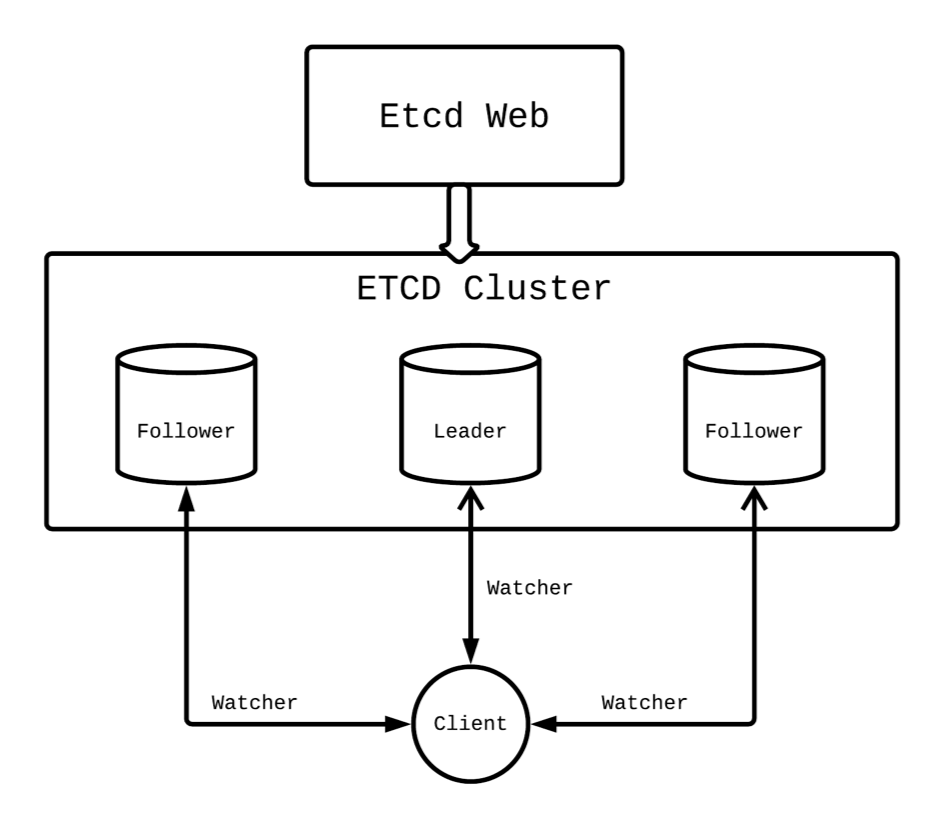

1. 项目内容

   基于etcd的搭建配置中心

   - etcd是关键数据的分布式可靠kv存储。主要用于一些基础组件事务性数据的存储，强调数据和事务的一致性和可靠性。
   - 特点
     - 简单，user-facing API(gRPC)
     - 安全，automatic TLS 认证
     - 快速，10000 writes/sec的速率 
     - 可靠，Raft分布式算法

2. 分布式一致性算法

   1. Raft一致性算法

      - 节点的三个状态：跟随者、候选者、领导者。三个之间的转换关系如图。

        

      - 跟随者可以接受候选者的vote_rpc，根据版本号和任期号投出。可以接受领导者的心跳包，维持其leader状态。当timeout时间没收到包时，会转变为候选者状态，像其他节点发起投票。

      - 候选者，收到大多数节点的投票，会转变为领导者。在选举过程中发现任期数比自己高的候选者，会转变为跟随者。如果选举超时，会重新发起投票

      - 领导者，发现任期比自己高的节点会变为跟随者。会发送心跳包维持自己的领导地位；

   2. 领导人选举

      - 启动时的随机timeout时间
      - 增加自己的任期号，转变为候选人状态，发送请求投票RPCs

   3. 日志复制

      - 收到客户端请求时，并行发起**附加条目RPCs**给其他服务器，当这条日志被其他服务器复制后，领导者才会加入到它的状态机中，返还结果给客户端。
      - 领导人处理不一致是通过强制跟随者直接复制自己的日志来解决了。这意味着在跟随者中的冲突的日志条目会被领导人的日志覆盖

   4. 日志压缩

   5. 配置更改

3. 服务中配置的动态下发的结构

   - 

4. 主要代码结构和细节

   1. 本地缓存啊
   2. 起watch监控对应的配置
   3. 替换本地的配置 多线程同步的问题 读写锁