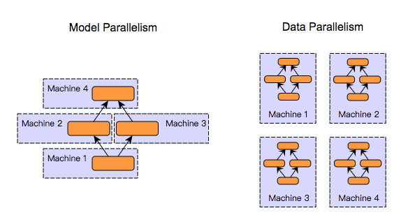
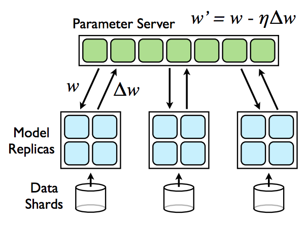
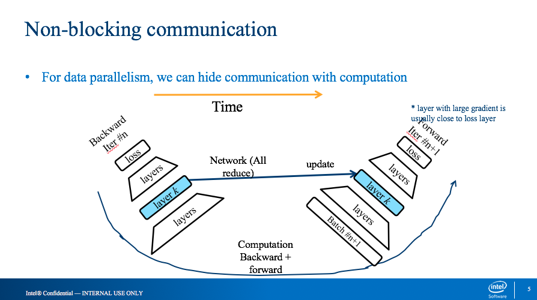

---

title: 分布式深度学习算法框架的实现
date: 2018-10-17 16:29:46
tags: Chainer
---

1. 分布式深度学习的几种分类

   

   - 数据并行 — 每台机器有自己的计算模型，权值进行共享

     - 权值同步更新 -- 有同步时间的矛盾，但是在收敛性上比较完整

     - 权值异步更新 -- 同步时间比较少，但是收敛性的验证不是很完备

       

   - 模型并行

     - 现阶段比较少的模型使用到

     - 不同的feature map 在不同的机器上

     - 或者不同的层在不同的机器上进行计算

2. Non-blocking的数据并行算法

   

   - forward运算时，y = w*x ，每个interation 需要等待上一个循环计算好的w值，除了第一个iteration。
   - 这里需要注意的问题时，当通信时间过长时，需要考虑weight的等待时间，多一些模型会有影响
   - backward运算时， dx = dy*w，backward计算时，不需要w进行更新的值，所以这里可以起一个线程进行all_reduce()，进行权值的更新。

3.  实验结果，相对于blocking的算法，训练时间上有20%-40%性能提升；

4. 对于异常点的监控

   1. 云服务中异常点的监控
   2. 采用异步的同步模型，收敛效果要监控