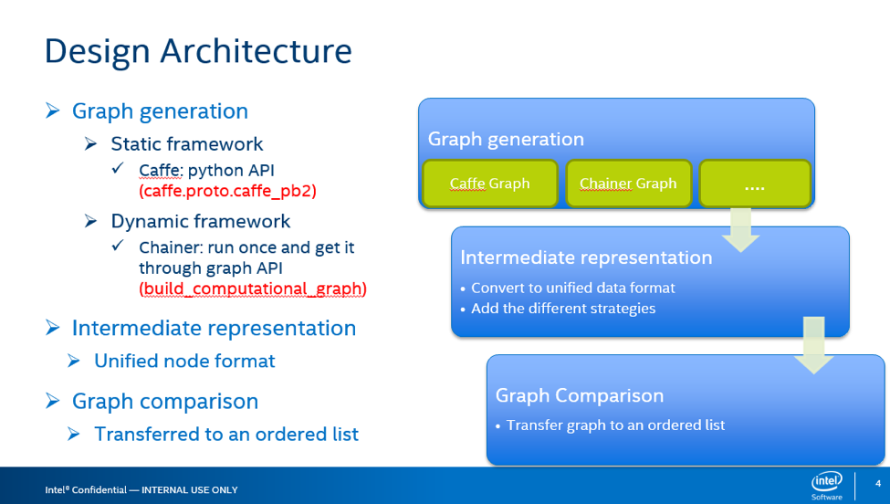
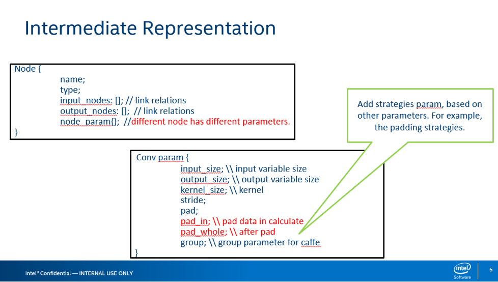
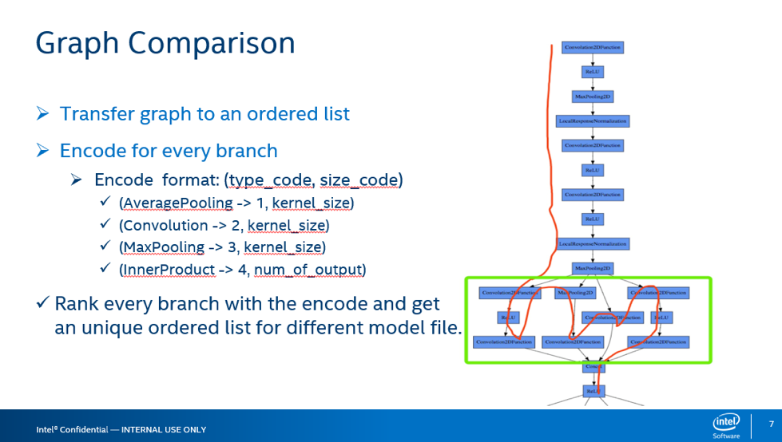
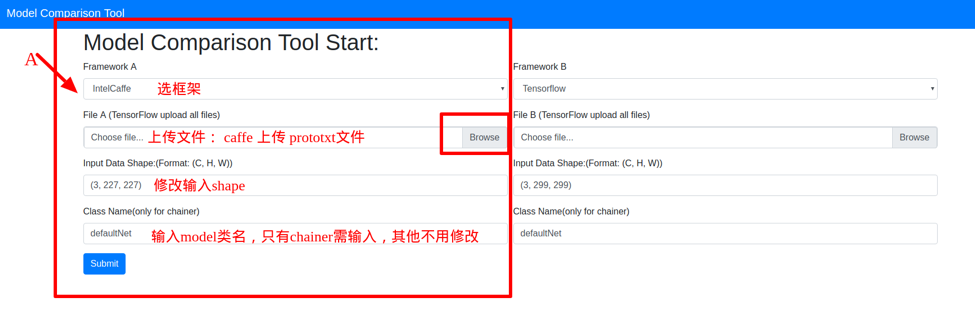
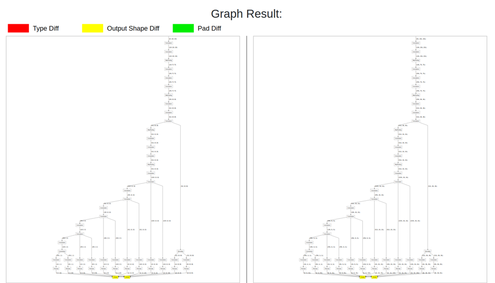

### Model Comparison Tool

&emsp;&emsp;Model comparisontool is a tool to help developer to compare difference between two model from different framework. The tool support **Caffe, TF, MXNet, Chainer,pytorch.** We mainly compare the variable node shape and functionnode type. We also compare the computation the graph and padding strategy.

&emsp;&emsp;We also develop a web model comparison tool for user. User just need upload their models file and see the visually graph comparison result. Below Section 1 is the design detail of the tool and Section 2 is the Web version Detail, final is the Deploy part. 

1. **Design Detail**

   - The whole tool based on the architecture as below.

   

   - In our tool, firstlly loading the graph from different framework. You can find the method to load function responding to different framework as the Table below.

   | Framework  | Input Files           | Function file         | Detail                                                       |
   | ---------- | --------------------- | --------------------- | ------------------------------------------------------------ |
   | Caffe      | train_val.prototxt    | load_caffe_model.py   | Based on the caffe.proto.caffe_pb2 to read model parameters. |
   | Tensorflow | model save files      | load_tf_model.py      | Read computation graph from stored model file. So User should save the graph before. |
   | Chainer    | model class .py files | load_chainer_model.py | Get all functionNode from output.                            |
   | MXNet      | model json file       | load_mxnet_model.py   | Read json file and parameters.                               |
   | SSD        | SSD model             | load_ssd_*.py         | SSD have special layer.                                      |

   - Convert to unified data format and add different pdding strategies, as the Figure below. Later version, we add pw, ph, sh, sw, kh, kw params. source code in rank_multi_port.py.

   

   - Graph comparison is a difficult problem. So we transfer graph to an ordered list and find all difference. Source code in rank_multi_port.py.

     模型比对使用拓扑排序将图模型有序的排出来

2. **Web Model Comparison Tool**

   For a better User Experience,  we develop a website. User just upload the input files and get the visual comparison result and detail parameters. The system combine **Django** backend and **Bootstrap** front end. Using **D3.js** to visualize the model graph. All source code in the *web-model-comparison-tool* folder.

   

   The website have two pages. In page 1, user upload their needing. Page 2 show the Graph result.

   

   


1. **Deploy Method**

   Our website verison deploy in <u>developer01</u> server. The root username <u>modeltools</u>, password: <u>abc110</u>. 

   1. ssh to the web server. 

   ```shell
      ssh modeltools@developer01
   ```

   1. cd to work folder.

      ```Shell
      cd ~/web-model-comparison-tool/model_comparison_tool/
      ```

   2. Start the uwsgi server.

      ```shell
      uwsgi —socket /tmp2/model_comparison_tool.sock —module model_comparison_tool.wsgi —chmod-socket=777 —uid=www-data —gid=www-data
      ```

   3. Restart the nginx service.

      ```shell
      sudo /etc/init.d/nginx restart
      ```

   4. Now you can browser the site: server local IP:8000 to use our tool.

   If wanna know more, please click on [HELP](https://uwsgi-docs.readthedocs.io/en/latest/tutorials/Django_and_nginx.html#configure-nginx-for-your-site).