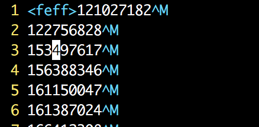

## Golang - Read a UTF-8 text file with BOM 

#### 背景

开发中遇到一个上传文件的需求，通过规定上传的文件会将账号按行排列。 Bug复现为，当上传的文件是excel (Win)系产品导出的文件时，会在文首解析出不可显的字符，导致后端在解析时会校验错误。导致文件上传失败。 



用`vim -b ./file ` 打开文件发现了文首的不可见字符 `\uFEFF`。搜索后才知道这个是UTF编码自带的编码顺序标记。所以本文接下来分别介绍下，1. BOM的详细信息，2. 以及我在golang的服务中是怎么处理这种兼容的状况的。

#### BOM (bytes order marker)

From [Wikipedia](http://en.wikipedia.org/wiki/Byte_order_mark), the byte order mark (BOM) is a Unicode character used to signal the endianness (byte order) of a text file or stream. It's code point is U+FEFF. BOM use is optional, and, if used, should appear at the start of the text stream. 引用阮一峰老师的一段话：

> Unicode编码中表示字节排列顺序的那个文件头，叫做BOM（byte-order mark），FFFE和FEFF就是不同的BOM。
>
> UTF-8文件的BOM是“EF BB BF”，但是UTF-8的字节顺序是不变的，因此这个文件头实际上不起作用。有一些编程语言是ISO-8859-1编码，所以如果用UTF-8针对这些语言编程序，就必须去掉BOM，即保存成“UTF-8—无BOM”的格式才可以，PHP语言就是这样。

#### big endian and little endian

对于大端模式和小端模式自己之前一直没弄明白，这里又碰见算是在熟悉一遍。再引用一遍阮老师的话做记忆：

> 以汉字`严`为例，Unicode 码是`4E25`，需要用两个字节存储，一个字节是`4E`，另一个字节是`25`。存储的时候，`4E`在前，`25`在后，这就是 Big endian 方式；`25`在前，`4E`在后，这是 Little endian 方式。
>
> 这两个古怪的名称来自英国作家斯威夫特的《格列佛游记》。在该书中，小人国里爆发了内战，战争起因是人们争论，吃鸡蛋时究竟是从大头(Big-endian)敲开还是从小头(Little-endian)敲开。为了这件事情，前后爆发了六次战争，一个皇帝送了命，另一个皇帝丢了王位。
>
> 第一个字节在前，就是"大头方式"（Big endian），第二个字节在前就是"小头方式"（Little endian）。
>
> 那么很自然的，就会出现一个问题：计算机怎么知道某一个文件到底采用哪一种方式编码？
>
> Unicode 规范定义，每一个文件的最前面分别加入一个表示编码顺序的字符，这个字符的名字叫做"零宽度非换行空格"（zero width no-break space），用`FEFF`表示。这正好是两个字节，而且`FF`比`FE`大`1`。
>
> 如果一个文本文件的头两个字节是`FE FF`，就表示该文件采用大头方式；如果头两个字节是`FF FE`，就表示该文件采用小头方式。

从大头敲开，自然是先存前面字节再存后面， 从小头敲开自然是先存吃后面字节在吃前面。 这个问题又让自己重新规整了一下在操作系统中的字节序和网络通信中的字节序的不同：

1. x86 CPU 一般都是小端字节序
2. TCP/IP中规定采取大端字节序

```c
#include <stdio.h>
// 判断系统是大端系统还是小端系统
int main()
{
    unsigned int x = 0x12345678;

    if (*(char *)&x == 0x78)
    {
        printf("little-endian.\n");
    }
    else if (*(char *)&x == 0x12)
    {
        printf("big-endian\n");
    }
    else
    {
        printf("confused.\n");
    }

    return 0;
}

```

关于系统提供的主机和网络的字节序转换，留坑待填。

#### Golang 解决方案

我们采用的解决方案也比较的简单，就是当发现BOM时，将第一行的BOM给去掉。代码上使用了golang的strings去替换。

```go
package main

import (
	"bufio"
	"fmt"
	"os"
	"strings"
)
// FEFF because this is the Unicode char represented by the UTF-8 byte order mark (EF BB BF)
func main (){
	b, err := os.Open("./src/puin.csv")

	if err != nil {
		fmt.Println(err)
		return
	}
	scanner := bufio.NewScanner(b)
	
	scanner.Scan()
	firstline := scanner.Text()
	firstline = strings.Replace(firstline, "\uFEFF", "", -1)
	fmt.Println(firstline)

	for scanner.Scan()  {
		data := scanner.Text()
		fmt.Println(data)
	}
}
```

当然也有一些更通用的方案在Java的生态环境。The [Apache IO Commons](http://commons.apache.org/io/api-release/org/apache/commons/io/input/BOMInputStream.html) provides some tools to handle this situation. The BOMInputStream class detects the BOM and, if required, can automatically skip it and return the subsequent byte as the first byte in the stream. 这里就不再赘述，先睡了。

#### 参考资料

[Handle UTF8 file with BOM]: http://www.rgagnon.com/javadetails/java-handle-utf8-file-with-bom.html	"Handle UTF8 file with BOM"
[字符编码笔记：ASCII，Unicode 和 UTF-8]: http://www.ruanyifeng.com/blog/2007/10/ascii_unicode_and_utf-8.html

